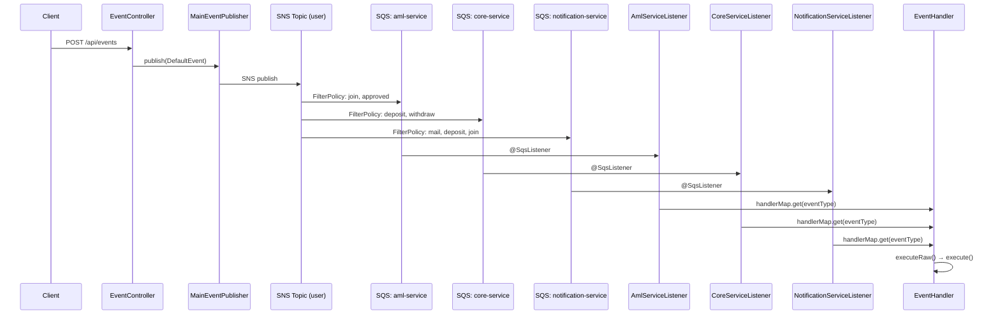
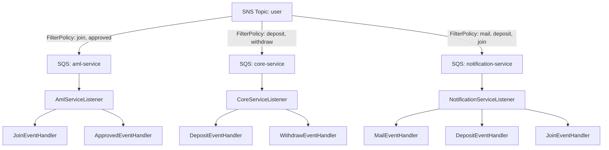

# Queue - Event Processing System

SNS/SQS 기반의 이벤트 처리 시스템입니다. 단일 SNS Topic에서 FilterPolicy를 활용하여 여러 SQS Queue로 이벤트를 라우팅하고, 각 서비스별 Listener가 적절한 Handler를 통해 비즈니스 로직을 실행합니다.

## Tech Stack

- Java 17
- Spring Boot 3.5.x
- Spring Cloud AWS (SNS, SQS)
- AWS LocalStack (로컬 개발 환경)
- Gradle 8.x (Groovy DSL)
- Lombok
- Docker Compose

## Architecture

### 전체 이벤트 흐름



### SNS/SQS 구독 관계



## Event Types

| EventType | aml-service | core-service | notification-service |
|-----------|:-----------:|:------------:|:--------------------:|
| JOIN      | O           |              | O                    |
| APPROVED  | O           |              |                      |
| DEPOSIT   |             | O            | O                    |
| WITHDRAW  |             | O            |                      |
| MAIL      |             |              | O                    |

## Project Structure

```
src/main/java/com/juno/queue/
├── QueueApplication.java
├── controller/
│   └── EventController.java              # POST /api/events
├── event/
│   ├── dto/
│   │   ├── DefaultEvent.java             # 이벤트 공통 DTO
│   │   ├── EventType.java                # enum: DEPOSIT, WITHDRAW, JOIN, APPROVED, MAIL
│   │   ├── PublishEventRequest.java       # API 요청 DTO
│   │   └── payload/
│   │       ├── EventPayload.java          # 페이로드 공통 인터페이스
│   │       ├── ApprovedEventPayload.java
│   │       ├── DepositEventPayload.java
│   │       ├── JoinEventPayload.java
│   │       ├── MailEventPayload.java
│   │       └── WithdrawEventPayload.java
│   ├── handler/
│   │   ├── EventHandler.java             # 추상 클래스 (executeRaw → execute)
│   │   ├── ApprovedEventHandler.java
│   │   ├── DepositEventHandler.java
│   │   ├── JoinEventHandler.java
│   │   ├── MailEventHandler.java
│   │   └── WithdrawEventHandler.java
│   └── publisher/
│       └── MainEventPublisher.java       # SNS 발행
├── aml/listener/
│   └── AmlServiceListener.java           # SQS: aml-service
├── core/listener/
│   └── CoreServiceListener.java          # SQS: core-service
└── notification/listener/
    └── NotificationServiceListener.java  # SQS: notification-service
```

## Build & Run

### Prerequisites

- Java 17+
- Docker & Docker Compose

### 1. LocalStack 실행

```bash
docker compose up -d
```

LocalStack이 시작되면 `localstack/init-aws.sh`가 자동으로 SNS Topic과 SQS Queue를 생성하고 구독/FilterPolicy를 설정합니다.

### 2. Application 실행

```bash
./gradlew bootRun
```

### 3. Event 발행 테스트

```bash
curl -X POST http://localhost:8080/api/events \
  -H "Content-Type: application/json" \
  -d '{
    "eventId": "evt-001",
    "eventType": "JOIN",
    "payload": {
      "userId": "user-123",
      "username": "juno"
    }
  }'
```

### Build Commands

```bash
./gradlew build          # 빌드
./gradlew clean build    # 클린 빌드
./gradlew test           # 전체 테스트
```
