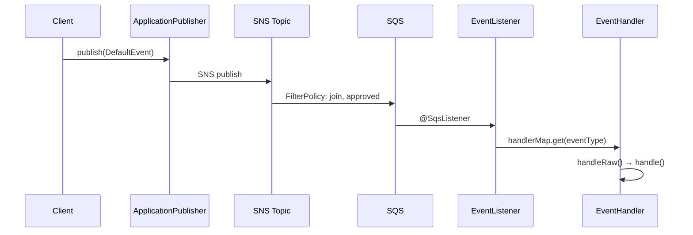

# Queue - Event Processing System

SNS/SQS 기반의 이벤트 처리 시스템입니다. 단일 SNS Topic에서 FilterPolicy를 활용하여 여러 SQS Queue로 이벤트를 라우팅하고, 각 서비스별 Listener가 적절한 Handler를 통해 비즈니스 로직을 실행합니다.

## Architecture

### 전체 이벤트 흐름

